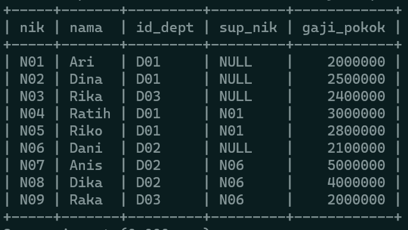

# PRAKTIKUM7_SUBQUERY

```
Nama    : Dipca Anugrah
Kelas   : 312210666
NIM     : TI.22.A.4
```

# **SQL SUBQUERY**

SQL subquery adalah sebuah pernyataan SQL yang tertanam di dalam pernyataan SQL utama. Subquery berfungsi untuk menghasilkan set data sementara yang akan digunakan dalam pernyataan utama untuk melakukan pemfilteran, penggabungan, atau perhitungan lebih lanjut.

Subquery biasanya terletak di dalam klausa `WHERE`, `FROM`, atau `SELECT` pernyataan utama, dan dapat mengambil bentuk yang berbeda, seperti:

1. Subquery dalam klausa `WHERE`: Subquery digunakan untuk menyediakan kriteria pemfilteran tambahan dalam klausa `WHERE` pernyataan utama. Subquery ini akan menghasilkan set data yang digunakan untuk membatasi baris yang dipilih dalam pernyataan utama.

2. Subquery dalam klausa `FROM`: Subquery digunakan untuk menghasilkan set data sementara yang akan digunakan sebagai sumber data dalam pernyataan utama. Subquery ini akan berperan sebagai tabel virtual atau dikenal juga sebagai "derived table".

3. Subquery dalam klausa `SELECT`: Subquery digunakan untuk menghasilkan satu nilai atau satu set nilai yang akan ditampilkan dalam hasil kolom pernyataan utama. Subquery ini akan dievaluasi untuk setiap baris yang diproses dalam pernyataan utama.

Subquery sangat fleksibel dan kuat karena memungkinkan penggunaan operasi dan fungsi SQL lengkap di dalamnya. Ini memungkinkan kita untuk menggabungkan, memfilter, dan menghitung data secara lebih kompleks dan terperinci dalam pernyataan SQL.

## **STUDI KASUS**

**1. Tabel Departemen**


**2. Tabel Perusahaan**


**2. Tabel Karyawan**


**4. Tabel Project**


**5. Tabel Project Detail**  
 

### **A. Contoh kasus**

1.  Menampilkan gaji karyawan yang memiliki gaji lebih besar dari pada karyawan dengan nama Riko

    ```sql
    SELECT k.nik, k.nama,gaji_pokok
    FROM karyawan k
    WHERE gaji_pokok > (
    SELECT gaji_pokok
    FROM karyawan k
    WHERE nama = 'Riko');
    ```

    

2.  Menampilkan karyawan yang memiliki atasan yang sama dengan karyawan dengan nama Riko

    ```sql
    SELECT k.nik, k.nama
    FROM karyawan k
    WHERE sup_nik = (
    SELECT sup_nik
    FROM karyawan
    WHERE nama = 'Riko');
    ```

    

3.  Menampilkan karyawan yang menjadi bawahannya karyawan dengan nama Ari

    ```sql
    SELECT k.nik, k.nama
    FROM karyawan k
    WHERE sup_nik = (
    SELECT nik
    FROM karyawan
    WHERE nama = 'Ari');
    ```

    

4.  Menampilkan karyawan yang memiliki gaji_pokok paling kecil.
    ```sql
    SELECT k.nik, k.nama, k.gaji_pokok
    FROM karyawan k
    WHERE gaji_pokok = (
    SELECT MIN(gaji_pokok)
    FROM karyawan GROUP BY 'gaji');
    ```
    

### **B. Latihan**

1.  Menampilkan data karyawan yang bekerja pada departemen yang sama
    dengan karyawan yang bernama Dika

        ```sql
        SELECT k.nik, k.nama, k.sup_nik
        FROM karyawan k
        WHERE id_dept = (
        SELECT id_dept
        FROM karyawan
        WHERE nama = 'Dika');
        ```
        

2.  Menampilkan data karyawan yang gajinya lebih besar dari rata-rata gaji semua karyawan. urutkan menurun berdasarkan besaran gaji

    ```sql
    SELECT k.nik, k.nama, k.sup_nik, k.gaji_pokok
    FROM karyawan k
    WHERE gaji_pokok > (
    SELECT AVG(gaji_pokok)
    FROM karyawan
    ) ORDER BY gaji_pokok DESC;
    ```

    

3.  Menampilkan nik dan nama karyawan untuk semua karyawan yang bekerja di department yang sama dengan karyawan dengan nama yang mengandung huruf 'K'

    ```sql
    SELECT k.nik, k.nama
    FROM karyawan k
    WHERE id_dept IN (
    SELECT id_dept
    FROM karyawan
    WHERE nama LIKE '%K%');
    ```

    

4.  Manampilkan data karyawan yang bekerja pada departemen yang ada di kantor pusat

    ```sql
    SELECT k.nik, k.nama, k.sup_nik
    FROM karyawan k
    WHERE id_dept = (
    SELECT id_dept
    FROM departemen
    WHERE id_p = 'P01');
    ```

    

5.  Manampilkan nik dan nama karyawan untuk semua karyawan yang bekerja di department yang sama dengan karyawan dengan nama yang mengandung huruf 'K' dan yang gajinya lebih besar dari rata-rata gaji semua karyawan
    ```sql
    SELECT k.nik, k.nama
    FROM karyawan k
    WHERE id_dept IN (
    SELECT id_dept
    FROM karyawan
    WHERE nama LIKE '%K%')
    AND gaji_pokok > (
    SELECT AVG(gaji_pokok)
    FROM karyawan
    );
    ```
    

[Back->](#praktikum7_subquery)
